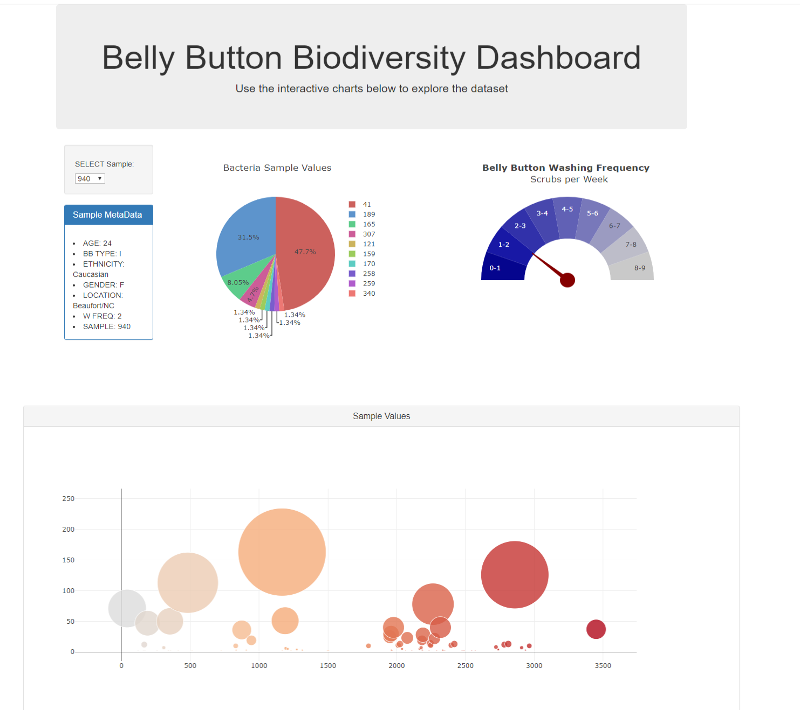

# Biodiversity Dashboard

 The belly button data is stored in sqlite database files with a Flask API server providing JSON files at the following endpoints. 
 
 `/names` provides the list of sampe names.  
 
 `/metadata/<sample>` provides the metadata about a particular sample. 
 
 `/samples/<sample>` returns the data for the given sample number.

 `/wfreq/<sample>` returns the value for washing frequency for the guage chart
 
 The front end is built from HTML, Javascript, and Plotly with D3. The table displays all the meta data about the participant. A Plotly pie chart, bubble chart and washing frequency gauge display data for the selected sample number. 

 It is also deployed on Heroku at https://biodiversity-belly-buttons.herokuapp.com/

 * Note: To run the visualization after downloading you'll need to use `sh run.sh` initiated from command line.  Requirements are noted in requirements.txt. This will host the page at ` http://127.0.0.1:5000/` in your web browser. 
