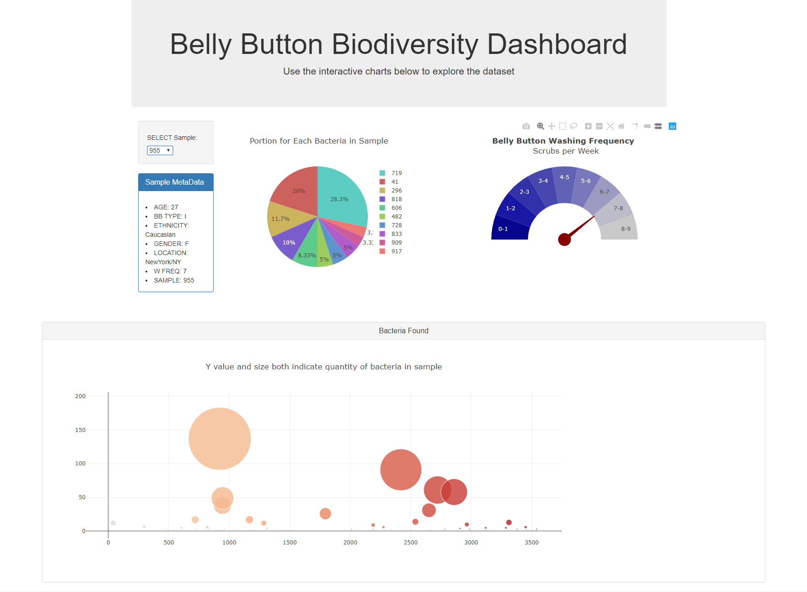

# Biodiversity Dashboard

 The goal of this project is to provide a dashboard for exploring the data from belly button bacteria samples. Each sample includes 
 information about the subject, their washing habits and the bacteria found in the sample. Some of the bacteria are identified specifically while most are merely categorized as bacteria. 
 
 The belly button data is stored in sqlite database files with a Flask API server providing JSON files at the following endpoints. 
 
 `/names` provides the list of sampe names.  
 
 `/metadata/<sample>` provides the metadata about a particular sample. 
 
 `/samples/<sample>` returns the data for the given sample number.

 `/wfreq/<sample>` returns the value for washing frequency for the gauge chart
 
 The front end is built from HTML, Javascript, and D3 with Plotly. The table displays all the meta data about the participant. A Plotly pie chart shows the bacteria found in the sample and their proportion. The bubble chart has a bubble for each bacteria found with its size indicating the quantity of the bacteria found. The washing frequency gauge indicates participants washing habits. All are displaying data for the selected sample number. 
 
 It is deployed on Heroku at https://biodiversity-belly-buttons.herokuapp.com/

 * Note: To run the visualization after downloading you'll need to use `sh run.sh` initiated from command line.  Requirements are noted in requirements.txt. This will host the page at ` http://127.0.0.1:5000/` in your web browser. 
